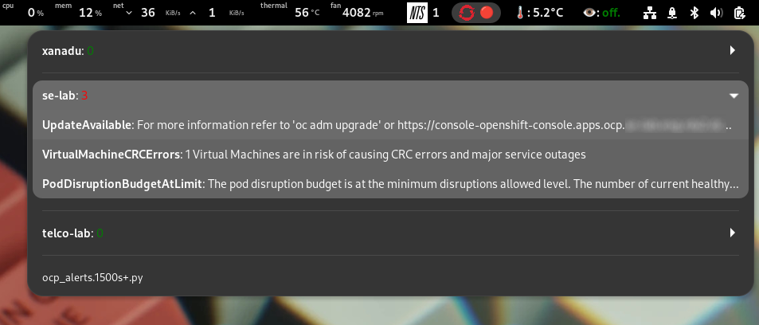

# OCP Alerts Extension for Argos
This repo contains a simple extension for [argos](https://github.com/p-e-w/argos) - and so therefore perhaps [xbar](https://github.com/matryer/xbar)* - to display active alerts for a configured set of OpenShift clusters.

\* not tested

## Configuration
Fill in the cluster details in `clusters.yaml` and copy to the `config` directory:
~~~
mkdir ~/.config/ocp-alerts
cp clusters.yaml ~/.config/ocp-alerts/
~~~

The syntax for the config is as follows:
~~~
clusters:
    cluster0:
        url: https://alertmanager-main-openshift-monitoring.apps.cloud.example.com
        token: eyJhbGciOiJSUzI1NiIsImtpZCI6IlRkUnBKcmktV1ZlbkZJOVZCOTNYWlNFcEZrWGI2
        severity: ["warning", "critical", "info"]
    cluster1:
        url: https://alertmanager-main-openshift-monitoring.apps.lab.example.com
        token: eyJhbGciOiJSUzI1NiIsImtpZCI6InFOYk0wNHA0YWdzZ3dJRGhNZ0xUWExIY0EtYlV
        severity: ["warning", "critical"]
    cluster2:
        url: https://alertmanager-main-openshift-monitoring.apps.qa.example.com
        token: eyJhbGciOiJSUzI1NiIsImtpZCI6ImY5bkRfN3FIQWw5Y3VUalhtd0Rscy1PS2NnWH
        severity: ["warning", "critical", "info"]
~~~

The url can be determined with
~~~
oc get routes -n openshift-monitoring prometheus-k8s -o json | jq -r .spec.host
~~~

Any valid token with sufficient privileges will do, such as
~~~
oc get secret -n openshift-monitoring $(oc get secret -n openshift-monitoring | grep prometheus-k8s-token | awk '{print $1}')  -o json | jq -r '.data.token|@base64d'
~~~

Copy `ocp-alerts.py` to `~/.config/argos` and rename it to reflect desired update interval in seconds. For example, to run the script and update the status every 15 minutes, the script should be `~/.config/argos/ocp-alerts.1500s+.py`.

## Demo

This is how it should look:

